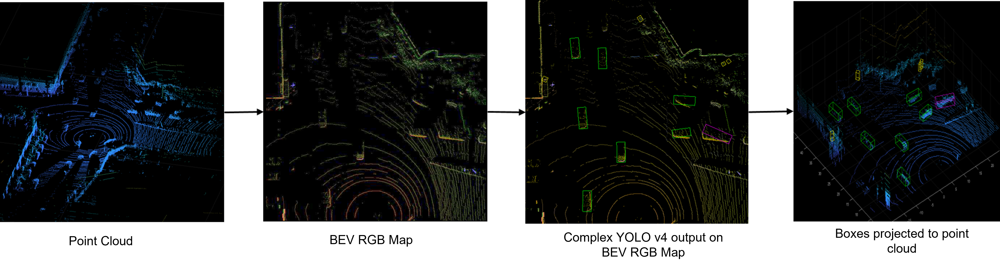
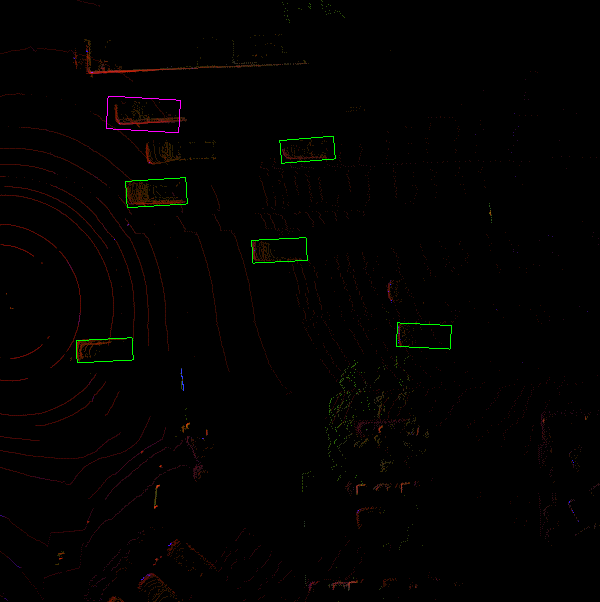
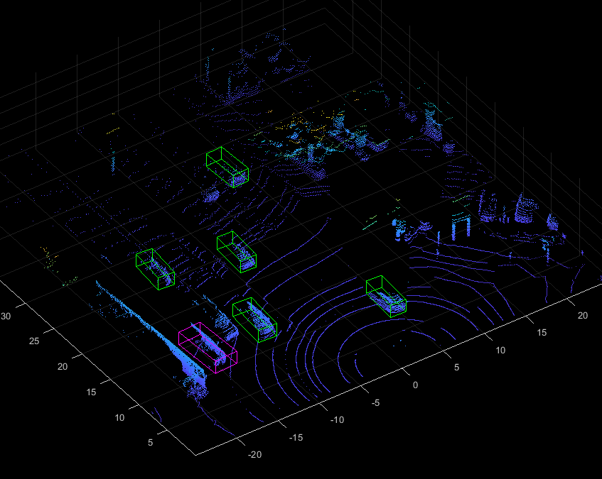

# Complex YOLO v4 Network For Lidar Object Detection

This repository provides a pretrained Complex YOLO v4 Lidar object detection network for MATLAB&reg;. 

Requirements
------------  

- MATLAB&reg; R2021a or later
- Deep Learning Toolbox&trade;
- Lidar Toolbox&trade;

Overview
--------

YOLO v4[1] is a popular single stage object detector that performs detection and classification using CNNs. In this repository we use Complex-YOLO v4[2] approach, which is a efficient method for Lidar object detection that directly operates Birds-Eye-View (BEV) transformed RGB maps to estimate and localize accurate 3-D bounding boxes. The bounding boxes detected on the RGB-maps are projected back onto the point cloud to generate 3-D bounding boxes. The detection head of YOLOv4 model was modified to predict the angle regression along with bounding boxes, objectness score and classification scores. 



This repository implements two variants of the complex YOLO v4 object detectors:
- **complex-yolov4-pandaset**: Standard complex yolov4 network for accurate object detection.
- **tiny-complex-yolov4-pandaset**: Lightweight complex yolov4 network for faster inference.

The pretrained networks are trained on three different object categories Car, Truck and Pedestrain. These networks are trained using Pandaset dataset[3].

For other variant of Lidar object detection network, refer [Lidar 3-D Object Detection Using PointPillars Deep Learning](https://www.mathworks.com/help/lidar/ug/object-detection-using-pointpillars-network.html).

Getting Started
---------------

Download or clone this repository to your machine and open it in MATLAB&reg;.

### Setup
Add path to the source directory.

```
addpath('src');
```

### Download the pretrained network
Use the below helper to download the complex YOLO v4 pretrained models. Use "complex-yolov4-pandaset" model name for selecting standard complex YOLO v4 pretrained network and "complex-yolov4-tiny-pandaset" model name for tiny complex YOLO v4 network. 

```
modelName = 'complex-yolov4-pandaset';
model = helper.downloadPretrainedYOLOv4(modelName);
net = model.net;
```

### Detect Objects Using Pretrained complex YOLO v4 

```
% Read point cloud.
ptCld = pcread('pointclouds/0001.pcd');

% Get the configuration parameters.
gridParams = helper.getGridParameters;

% Get classnames of Pandaset dataset.
classNames = helper.getClassNames;

% Get the birds's-eye-view RGB map from the point cloud.
[img,ptCldOut] = helper.preprocess(ptCld, gridParams);

% Get anchors used in training of the pretrained model.
anchors = helper.getAnchors(modelName);

% Detect objects in test image.
executionEnvironment = 'auto';
[bboxes, scores, labels] = detectComplexYOLOv4(net, img, anchors, classNames, executionEnvironment);

figure
imshow(img)
showShape('rectangle',bboxes(labels=='Car',:),...
          'Color','green','LineWidth',0.5);hold on;
showShape('rectangle',bboxes(labels=='Truck',:),...
          'Color','magenta','LineWidth',0.5);
showShape('rectangle',bboxes(labels=='Pedestrain',:),...
          'Color','yellow','LineWidth',0.5);
hold off;
```
### Transfer Bounding Boxes to Point Cloud

```
% Transfer labels to point cloud.
bboxCuboid = helper.transferbboxToPointCloud(bboxes,gridParams,ptCldOut);

figure
pcshow(ptCldOut.Location);
showShape('cuboid',bboxCuboid(labels=='Car',:),...
          'Color','green','LineWidth',0.5);hold on;
showShape('cuboid',bboxCuboid(labels=='Truck',:),...
          'Color','magenta','LineWidth',0.5);
showShape('cuboid',bboxCuboid(labels=='Pedestrain',:),...
          'Color','yellow','LineWidth',0.5);
hold off;
```

### Results
Left-side image is the network output on the Bird's-eye-view image and right-side image shows the bounding boxes detected from image transferred on to the point cloud. The image is taken from the [Panda Set](https://scale.com/open-datasets/pandaset) dataset[2].

<table>
<tr>
    <td>  </td>
    <td>  </td>
</tr>
</table>

Train Custom Complex YOLO v4 Using Transfer Learning
----------------------------------------------------
Run the `createTrainingData.m` function to download the Pandaset dataset[3] and create the RGB maps from the lidar data used to train the complex-YOLOv4 network.

Transfer learning enables you to adapt a pretrained complex YOLO v4 network to your dataset. Create a custom complex YOLO v4 network for transfer learning with a new set of classes and train using the `complexYOLOv4TransferLearn.m` script.

Code Generation for Complex YOLO v4
-----------------------------------
Code generation enables you to generate code and deploy complex YOLO v4 on multiple embedded platforms.

Run `codegenComplexYOLOv4.m`. This script calls the `complexYOLOv4Predict.m` entry point function and generate CUDA code for complex-yolov4-pandaset or complex-yolov4-tiny-pandaset models. It will run the generated MEX and give output.  

| Model | Speed(FPS) with Codegen| Speed(FPS) w/o Codegen | 
| ------ | ------ | ------ | 
| complex-yolov4-pandaset | 14.663 | 1.4738 |
| tiny-complex-yolov4-pandaset | 44.248 | 9.93 |

- Performance (in FPS) is measured on a TITAN-RTX GPU.

For more information about codegen, see [Deep Learning with GPU Coder](https://www.mathworks.com/help/gpucoder/gpucoder-deep-learning.html)

Complex YOLO v4 Network Details
-------------------------------
Complex YOLO v4 network architecture is comprised of three sections i.e. Backbone, Neck and Detection Head.


- **Backbone:** CSP-Darknet53(Cross-Stage-Partial Darknet53) is used as the backbone for YOLO v4 networks. This is a model with a higher input resolution (608 x 608), a larger receptive field size (725 x 725), a larger number of 3 x 3 convolutional layers and a larger number of parameters. Larger receptive field helps to view the entire objects in an image and understand the contexts around those. Higher input resolution helps in detection of small sized objects. Hence, CSP-Darknet53 is a suitable backbone for detecting multiple objects of different sizes in a single image.

- **Neck:** This section comprised of many bottom-up and top-down aggregation paths. It helps to increase the receptive field further in the network and separates out the most significant context features and causes almost no reduction of the network operation speed. SPP (Spatial Pyramid Pooling) blocks have been added as neck section over the CSP-Darknet53 backbone. PANet (Path Aggregation Network) is used as the method of parameter aggregation from different backbone levels for different detector levels.

- **Detection Head**: This section processes the aggregated features from the Neck section and predicts the Bounding boxes, Angle regression,Objectness score and Classification scores. In addition to predicting the bounding boxes in conventional YOLOv4, we also predict the angle regression that estimates the heading of each 3-D box.

References
-----------

[1] Bochkovskiy, Alexey, et al. “YOLOv4: Optimal Speed and Accuracy of Object Detection.” ArXiv:2004.10934 [Cs, Eess], Apr. 2020. arXiv.org, http://arxiv.org/abs/2004.10934.

[2] Simon, Martin, et al. “Complex-YOLO: Real-Time 3D Object Detection on Point Clouds.” ArXiv:1803.06199 [Cs], Sept. 2018. arXiv.org, http://arxiv.org/abs/1803.06199. 

[3] [Panda Set](https://scale.com/open-datasets/pandaset) is provided by Hesai and Scale under the [CC-BY-4.0 license](https://creativecommons.org/licenses/by/4.0)

Copyright 2021 The MathWorks, Inc.
